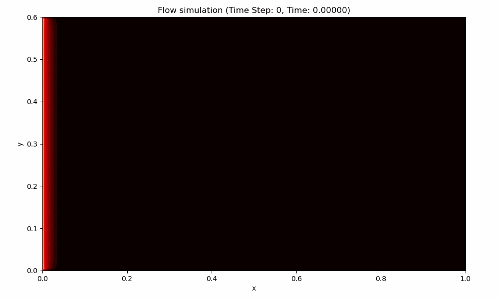

# 2D Hydrodynamic Flow simulation

This repository contains a 2D hydrodynamic flow simulation using the Navier-Stokes equations and MAC (Marker and Cell) discretization scheme.

The simulation is implemented in C and CUDA, and can be run on a single CPU or a GPU. The simulation is visualized using Python and `matplotlib`.

## Overview

Todo

## Simulation visualization



## Running tutorial

### C code (Non-parallel)

Make sure to have `gcc` or `clang` installed, and a Python environment with `matplotlib` and `numpy` installed.

```bash
# compile with gcc or clang
gcc simulation.c -o bin/simulation -lm

# run simulation
./bin/simulation

# activate Python environment with appropriate packages
# the line below would take a while to run
python visualize.py
```

The visualization will be saved at `simulation_animation.gif`.

### CUDA code (Parallel)

Todo

## References

Todo
